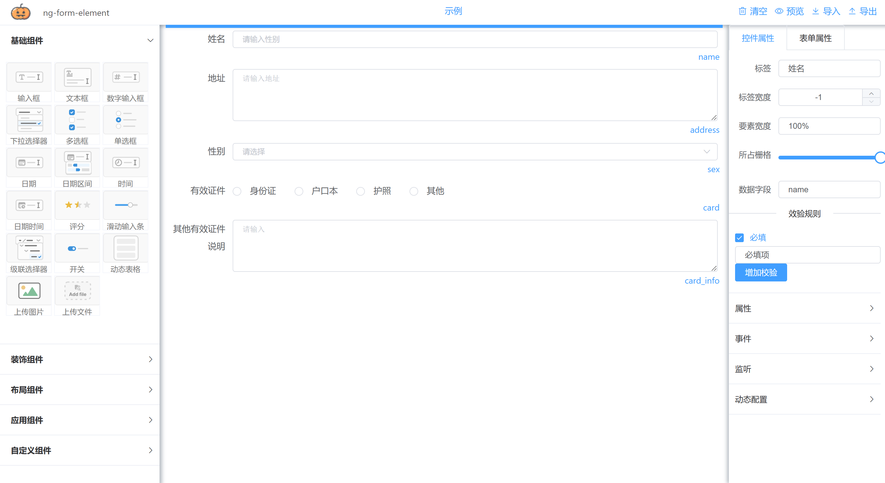
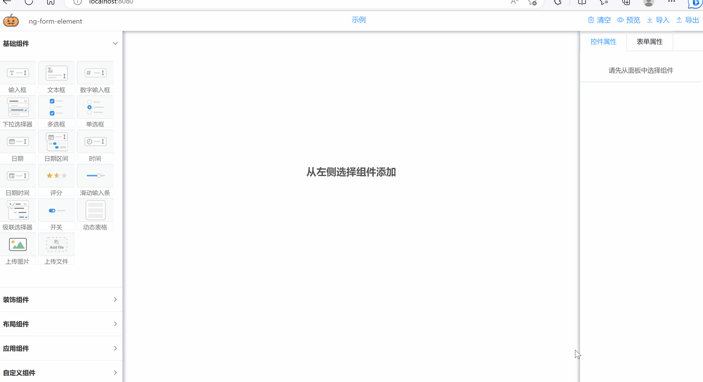
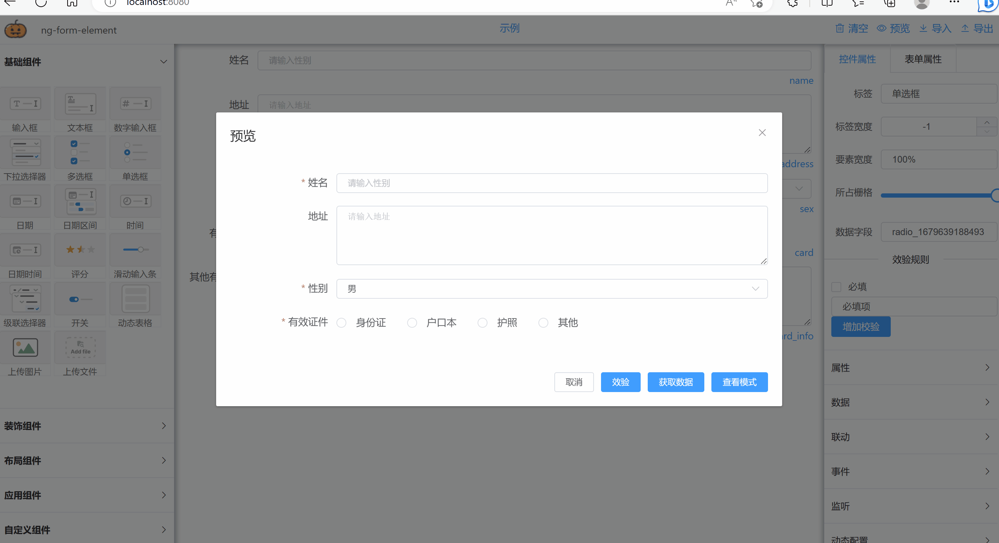

# ng-form 致力打造开源最强vue动态表单组件
NG-FORM-ELEMENTPLUS

  
 
 **说明**
 
目前已经开始启用2.0版本，配置基本兼容1.x版本。差异部分如下：
1. 1.x中日期中通过属性来配置是否可以范围选择，2.x版本拆成了两个组件
2. 2.x版本全局默认使用栅格布局，使用1.x的配置导入进来后，默认每个组件都是占24格


 **在线示例**
 https://jjxliu306.github.io/ng-form-elementplus/dist

 **element-ui版本地址**
 https://gitee.com/jjxliu306/ng-form-element

 **iview版本地址**
 https://gitee.com/jjxliu306/ng-form-iview

 
 
## 后端服务
**ngtool 后端解析和校验功能** 
https://gitee.com/jjxliu306/ngtool

## 文档（陆续更新）
http://www.ng-form.cn


<!--
## 集成示例
**基于springboot + vue 的前后端分离集成案例**

后端springboot: https://gitee.com/jjxliu306/ng-server

前端vue: https://gitee.com/jjxliu306/ng-ui
-->
##示例
 **基础表单** 
   


 **表单验证和组件动态显示** 



 **动态表格** 


## 简介

基于vue和element-plus实现的表单设计器。通过拖拽方式快速生成一个表单页面，表单可以导出json格式,也可以将其他人绘制的表单通过json导入方式进行还原。

## 和其他开源表单的差异
 
- 每个组件可以动态隐藏和显示，并且提供除了“必填”以外的多种规则验证，支持表达式验证和正则验证
- 隐藏的组件绑定值可以配置不输出，减少输出数据大小
- 针对选择性控件（radio，select，checkbox）提供选择后触发调用，支持表达式。对选择性控件支持数据联动功能，通过此功能可以做多级联动
- 动态表格提供单独的弹框进行填写和编辑
- 布局方式多样化，提供栅格，表格等多种布局方式 
- 支持表单预览模式，表单内容全部非组件化，全部文本显示
- 针对选择性控件（radio，select，checkbox）选择后将对应的label进行单独存储，方便展示

 

## 组件
- ng-form-design 表单设计器（基于可视化操作快速设计出表单页面，生成配置json或页面）
- ng-form-build 表单构建器（根据设计器中获取的配置json数据，快速构建出表单页面，添加readonly属性后展现预览表单）
 
 
## 安装
```
npm install --save  ng-form-elementplus

```
## 引用
```
 // 导入组件库
import NgFormElementPlus  from 'ng-form-elementplus'
import 'ng-form-elementplus/lib/style.css'
```

## 注册
``` 
const app = createApp(App)
 
// 注册组件库
app.use(NgFormElementPlus) 

```

### 页面引用
```
<div id="app"> 
    <ng-form-design  />
</div>
```
  
 
# 交流
点击链接加入qq群聊，可以直接提问及反馈bug 【交流群：203205848】 <a target="_blank" href="https://qm.qq.com/cgi-bin/qm/qr?k=vNN2AMPxXjojpwYu66DOGNtL2dFYh6Q-&jump_from=webapi"></a>
 